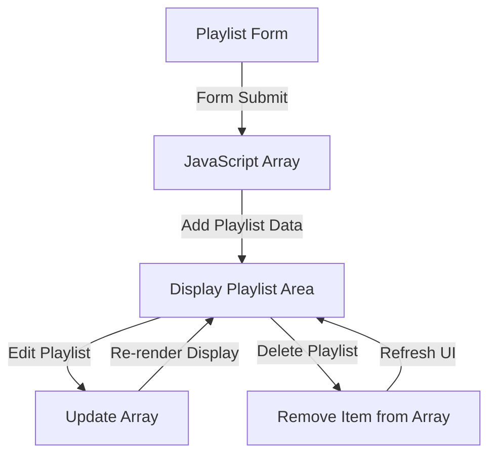

# Task 10 & 11

## Question:

Draw a diagram (on paper or using an online tool) that shows how data flows between your form, the JavaScript array, and the display area when adding, editing, or deleting a playlist.

Hint:
Use arrows to show the direction of data movement and label each step (e.g., 'Form Submit' → 'Add to Array' → 'Update Display').

## Answer:

### Playlist Data Flow Diagram

### Explanation:

- User enters playlist details in the form.
- After submitting the form, playlist data is stored in the JavaScript array.
- The display area reads data from the array and shows playlists.
- Edit action updates the existing playlist data in the array.
- Delete action removes the playlist from the array and refreshes the display area.